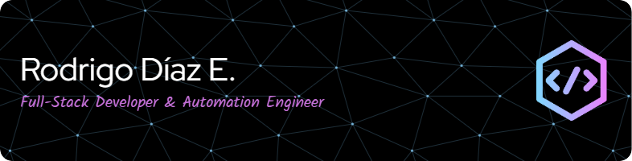

<h1 align="center"><b>Bienvenido a mi Github</b></h1> 

  

  
  
  

  

## 🛠️ Mi Stack Tecnológico

  <!-- Lenguajes -->
  

  

  

  <!-- Bases de datos -->
  
  
 
  
  
  <!-- DevOps -->
  

## 🔹 Frontend – Flutter Web
- Interfaces responsivas, adaptables y fluidas
- Formularios complejos con flujos tipo Stepper
- Filtros con debounce y multiselección avanzada
- Componentes personalizadas.
- Gestión de estado y rutas con GetX

## 🔹 Backend – FastAPI (Python)
- APIs RESTful limpias y seguras
- Paginación avanzada, manejo de errores HTTP
- Automatización de procesos backend (batch por Excel con `pandas`)
- Validaciones estructuradas con `pydantic` y `SQLAlchemy`
- Generación de credenciales y relaciones de usuario seguras

## 🔹 Bases de datos y entornos
- PostgreSQL y SQL Server
- Optimización de consultas relacionales
- Herramientas como **DBeaver**
- Desarrollo sobre **WSL en Windows**
- Git y GitHub (flujo profesional de ramas)

