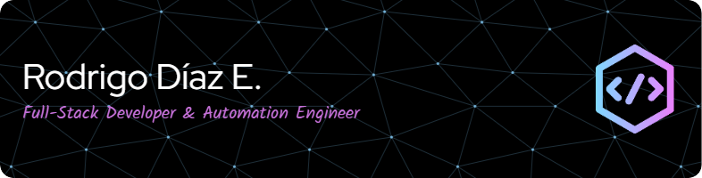

<h1 align="center"><b>Bienvenido a mi Github</b></h1>

  

  
  
  

## 👨‍💻 Full-Stack Developer | Flutter · FastAPI
Desarrollador full-stack con experiencia en **Flutter Web** y **FastAPI**, enfocado en crear soluciones web modernas, responsivas y escalables. Combino una sólida base técnica con sensibilidad por la experiencia del usuario y la claridad estructural.

  

## 🛠️ Mi Stack Tecnológico

  <!-- Lenguajes -->
  

  

  
  
          

  

  <!-- Bases de datos -->
  
  
 
  
  
  <!-- DevOps -->

  
          

  
  
  
  
  <!-- Otros -->

  
          

  
  
  
  
          

## 🔹 Frontend – Flutter
- Flutter Web + GetX
- Filtros dinámicos, multiselección, diseño responsivo
- Filtros con debounce y multiselección avanzada
- Componentes personalizados y UI centrada en el usuario

## 🔹 Backend – FastAPI (Python)
- FastAPI, RESTful APIs, paginación, manejo de errores HTTP
- Automatización de procesos backend batch por Excel con pandas.
- Testing con pytest para servicios, lógica y flujos
- SQLAlchemy, pydantic, generación de credenciales seguras

## 🔹 Bases de datos y entornos
- PostgreSQL · SQL Server · MongoDB
- Optimización de consultas relacionales
- Git · GitHub · WSL en Windows · CI/CD

